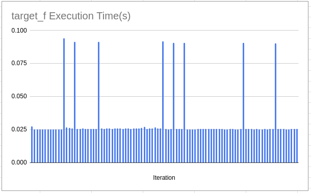

# Collecting CPU Hardware Event Counters using PCM

## Build and Install PCM
Clone the repository and build PCM
```
git clone https://github.com/opcm/pcm.git
cd pcm
make -j
sudo make install
```
You can build pcm with a dependency on perf (default) or without. I've run into  (and found multiple examples online) the following error after running with perf:
````
Error while reading perf data. Result is 0
Check if you run other competing Linux perf clients.
````
So I recommend building *without* perf.

#### Building with perf:
* Run the executable without root access is much easier
* Some counters might not be available - I don't fully grasp the difference here yet
Once building is complete you will need give yourself access to read MSR registers and well as disable `perf_event_paranoid` to enable rootless execution:
```
chmod go+rw /dev/cpu/*/msr
setcap cap_sys_rawio=ep ./driver
echo 0 > /proc/sys/kernel/perf_event_paranoid
```

#### Building without perf:
In the PCM makefile comment out these lines:
```
# rely on Linux perf support (user needs CAP_SYS_ADMIN privileges), comment out to disable
ifneq ($(wildcard /usr/include/linux/perf_event.h),)
CXXFLAGS += -DPCM_USE_PERF
endif
```

And do the same as with perf except you don't need to make any changes to `perf_event_paranoid`:
```
chmod go+rw /dev/cpu/*/msr
setcap cap_sys_rawio=ep ./driver
```

*IMPORTANT!* I won't pretend to fully understand this but after `setcap` `LD_LIBRARY_PATH` no longer works so you will run into the following error:
```
./driver: error while loading shared libraries: libpcm.so: cannot open shared object file: No such file or directory
```

To fix this either:
* `sudo cp pcm/libpcm.so /usr/lib`
* Add `rpath` when compiling:
  `-Wl,-rpath=/home/pvelesko/pcm`


# Example Problem
You are timing a certain part of your code and observe that the execution time for this target function sometimes spikes. It's not immidiately obvious as to why. 
Here's an example of what the graph of execution times could look like in this case:



You could profile this application but plain profiling poses several difficulties:
* The execution time for a single invocation of this function is too short to short to collect enough counters via multiplexing
* Most profiling tools aggregate function data leaving you no option to compare counter data between individual function invocations. 
  > You can do this using Intel Vtune with Tasks API TDB

### Game Plan
1. Collect the performance counters directly using PCM and dump this data to a CSV. 
   1. Time the target function
   2. Configure the HW counters
        > Since you have a limited number of HW counters you can either use round-robin multiplexing/rotation to get around the limits or recompile and run with differnt set of counters each run
   3. Run your code
   4. Read MSR and dump counter data to disk
2. Use python to analyze the findings
   1. Group invocations by time to seperate out your FAST and SLOW invocations
   2. Aggregate counter data
   3. Compare event counts hopefully revealing which HW Event is spiking causing SLOW executions

https://intel-pcm-api-documentation.github.io/annotated.html


#### Progam the HW Counters

You can collect up to 4 HW events at once. In order to configure this we must pass an array of 4 `CustomCoreEventDescription` items.
`CustomCoreEventDescription` is a struct with 2 fields - umask and event selector. The best place to get these values is at https://perfmon-events.intel.com/#. 
You can identify your CPU using `cpuinfo` or `lscpu` commands. If you don't see your processor listed it might be an iteration of a microarchitecture. For example, you could have a Comet Lake processor but that is not listed in perfmon website as it is the same microarchitecture (and HW counters) as Skylake. You can check this here: https://en.wikipedia.org/wiki/List_of_Intel_CPU_microarchitectures
Alternatively you can use `pcm/pmu-query.py` to explore the counters on your system interactively. I find this tool to be quite difficult to read so I prefer getting the counter info from the website. 


Let's select 6 counters we want to explore so that we have to use some sort of multiplexing to collect all of them in a single run. 
* LONGEST_LAT_CACHE.MISS
* FP_ARITH_INST_RETIRED.SCALAR_DOUBLE
* FP_ARITH_INST_RETIRED.128B_PACKED_DOUBLE
* FP_ARITH_INST_RETIRED.256B_PACKED_DOUBLE
* FP_ARITH_INST_RETIRED.512B_PACKED_DOUBLE
* ARITH.DIVIDER_ACTIVE

To multiplex the counters I implemented a singleton instance of the counters to rotate through them every invocation. 

#### Analyze data

Once data is collected and dumped into a csv file I use a jupyter notebook + pandas to analyze the data. 
Looking at the simple plot it's quite obvious that there are invocations that take much longer. I simply get the mean and seperate them out into FAST and SLOW regions. 

Then I aggregate all the counters and normalize to sample length which should give a representative view of FAST and SLOW counter results. 


Looking at the data we data we see the obvious: increased cache misses due to indirect random access and increased FP activity from calling `rand()`

## Notes
Ran into this error while playing around
````
WARNING: Custom counter 3 is in use. MSR_PERF_GLOBAL_INUSE on core 0: 0x70000000f
````
Fix:
Make sure that you run `resetPMU()` prior to programming counters each time.
